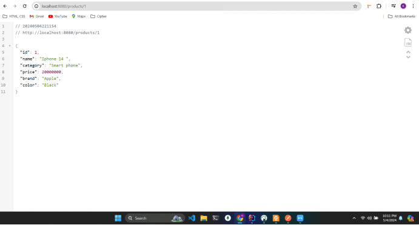

# Ecommerce
# Tổng quan công nghệ
- **Spring MVC (Model-View-Controller)**:
    - **Model**: Đại diện cho các đối tượng thực thể được ánh xạ từ cơ sở dữ liệu
    - **Controller**: Xử lý các yêu cầu từ người dùng và quyết định cách phản hồi
    - **View**: Giao diện người dùng, hiển thị dữ liệu từ Model
- **RESTful Web Services**:
    - Spring Web hỗ trợ việc xây dựng RESTful Web Services thông qua Spring MVC
    - Sử dụng annotation để đơn giản hóa việc tạo các RESTful endpoint
- **Thymeleaf (Template Engines)**:
    - Hỗ trợ các template engines như Thymeleaf để tạo giao diện người dùng
    - Tích hợp với Spring MVC để thực hiện các tính năng như điều kiện, vòng lặp và biểu thức
- **Spring Security**: Cung cấp các tính năng liên quan đến xác thực và phân quyền
- **Spring Data JPA**:
    - **JPA và ORM**:
        - JPA là một API của Java cho việc tương tác với cơ sở dữ liệu
        - Thực hiện việc ánh xạ giữa các lớp đối tượng Java và bảng trong cơ sở dữ liệu
    - **Repository Pattern**: Tự động tạo ra các phương thức tiêu biểu cho các thao tác cơ bản với cơ sở dữ liệu dựa vào tên của phương thức
    - **Quản Lý Truy Vấn**:
        - Sử dụng các quy ước đặt tên phương thức để tạo ra các câu truy vấn cơ sở dữ liệu mà không cần phải viết truy vấn SQL chi tiết
        - Sử dụng annotation @Query để viết truy vấn tùy chỉnh nếu cần khi quy ước tên quá dài
- **Lombok**:
    - **Annotation-Based Code Generation**: Sử dụng các annotation để sinh mã nguồn tự động cho các phương thức getter, setter, constructor, equals, hashCode, và toString
    - Sử dụng annotation @Getter và @Setter để tự động tạo phương thức getter và setter cho các thuộc tính trong lớp đối tượng
    - Sử dụng annotation @NoArgsConstructor, @RequiredArgsConstructor, và @AllArgsConstructor để tự động tạo constructor mặc định, constructor cho thuộc tính bắt buộc và constructor với tất cả các thuộc tính

# Cấu trúc hệ thống

- 
- 
- 

# Các bước thực hiện hệ thống
- Khởi tạo Java Spring Boot với intelij IDEA Ultimate
  
- Cấu hình **application.properties**
  
- Tạo các Model sử dụng trong hệ thống
- Tạo các Repository liên kết tới database
- Tạo các Service gồm các phương thức phục vụ truy xuất dữ liệu
- Tạo các Controller gắn với các endpoint để xử lí các tác vụ trên trình duyệt
- Tạo các file HTML trong thư mục templates là View mà người dùng có thể thấy và tương tác trên trình duyệt
- Dùng các hệ quản trị CSDL có PostgreSQL MySQL WorkBench, DBeaver...
- Thông tin kết nối database: user: **khoa**, password: **abc123**
- Tạo database với tên SpringCommerce
- Dùng tài khoản tạo sẵn: username: **khoa**, password: **1234**
- Chạy và trải nghiệm các tính năng của trang web

# Test API
- **http://localhost:8080/products**: Lấy danh sách sản phẩm
 + 
- **http://localhost:8080/products/{id}**: Lấy thông tin sản phẩm theo id
    + 
- **http://localhost:8080/products/{id}/addToCart**: Thêm sản phẩm vào giỏ hàng
    + 
- **http://localhost:8080/search?keyword=Black&minPrice=1&maxPrice=2000**: Tìm kiếm sản phẩm theo màu, giá
    + 
- **http://localhost:8080/search?keyword=Laptop&minPrice=1&maxPrice=2000**: Tìm kiếm sản phẩm theo tên, giá
    + 
